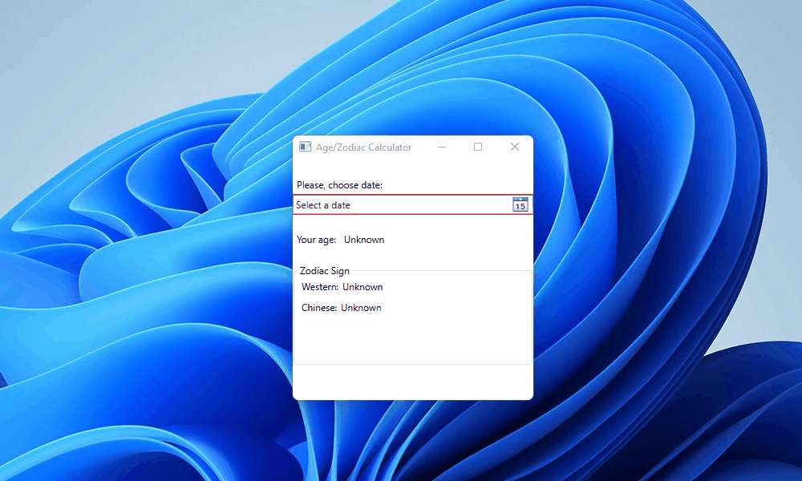
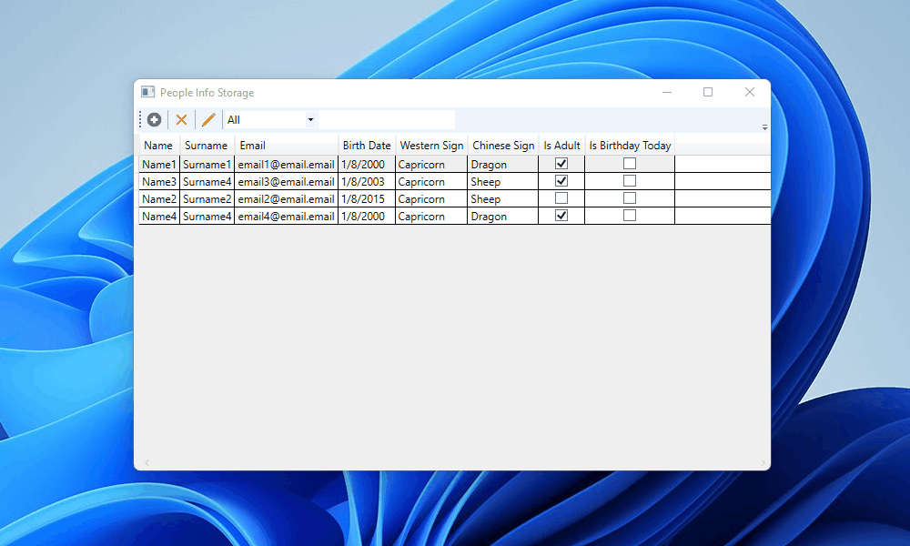
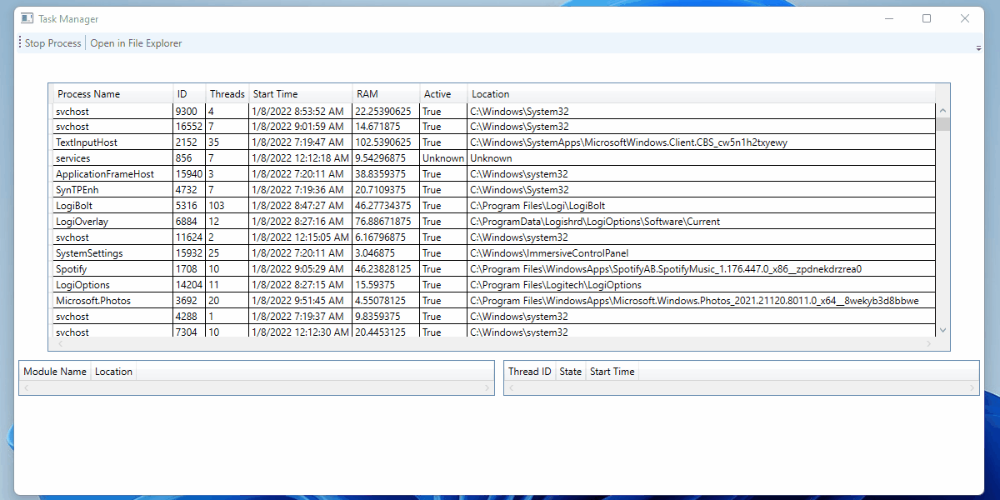

# WPF Studying Project

## Description

This is a repository, which contains projects I created to study basics of C# and WPF in university. During implementation of these projects I tried:

* to stick to SOLID design principles.
* to use known programming patterns where it was possible.
* to log all necessary information using Microsoft.Extensions.Logging library.
* to use automatic instance creation with dependency injection provided by Microsoft.Extensions.Hosting library.

### AgeZodiacCalculator Project

#### Description

This is my first project I created during my studies.

It is an application which requests a birthday date from the user. This date must not be in future and not before than 135 years from the current
date. Depending on the inserted date, this application calculates age, western and chinese zodiac signs. Age is represented in years, months and days.

#### Demonstration

### PeopleInfoStorage Project

#### Description

It is an application which allows its user to keep and manage information about people. A person in this application is represented by parameters:

| Parameter Name | Constraint                                                     |
|----------------|----------------------------------------------------------------|
| Name           | Must start with upper case letter                              |
| Surname        | Must start with upper case letter                              |
| Email          | Must match regex `\\w+@\\w+\\.\\w+`                            |
| BirthDay       | Must be between current date and date that is 135 years before |

Other parameters, which are displayed in the table, are calculated based on the parameters specified in the table above.

Implemented features:

* Can display/create/edit/delete data entered in the application.
* Can serialize data so that it can be used during next application execution.
* Can sort data.
* Can filter data.

#### Demonstration

### TaskManager Project

#### Description

It is an application, which allows its user to display information about currently running processes in its OS. Information is kept actual by periodic
update of processes parameters.

Implemented Features:

* Displays such information about the process:
    * Name
    * ID
    * Threads
    * Start Time
    * RAM
    * Active
    * Location
    * Modules:
        * Name
        * Location
    * Threads:
        * ID
        * State
        * Start Time
* Can try to stop the process
* Can try to open the location in the file system of the process

#### Demonstration

